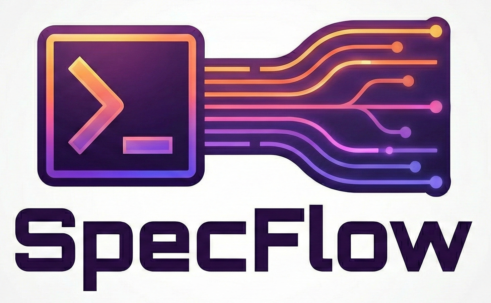
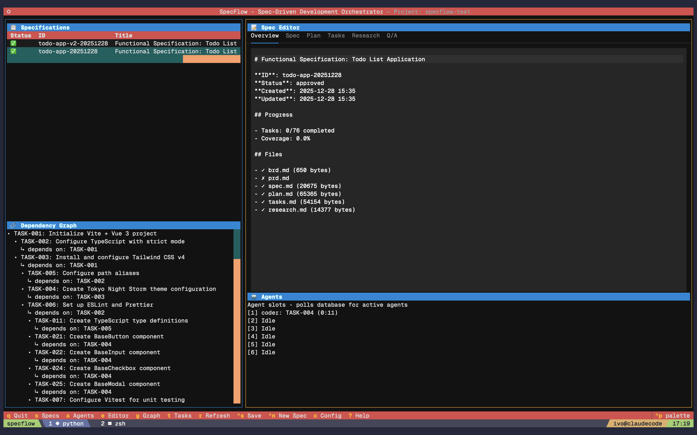
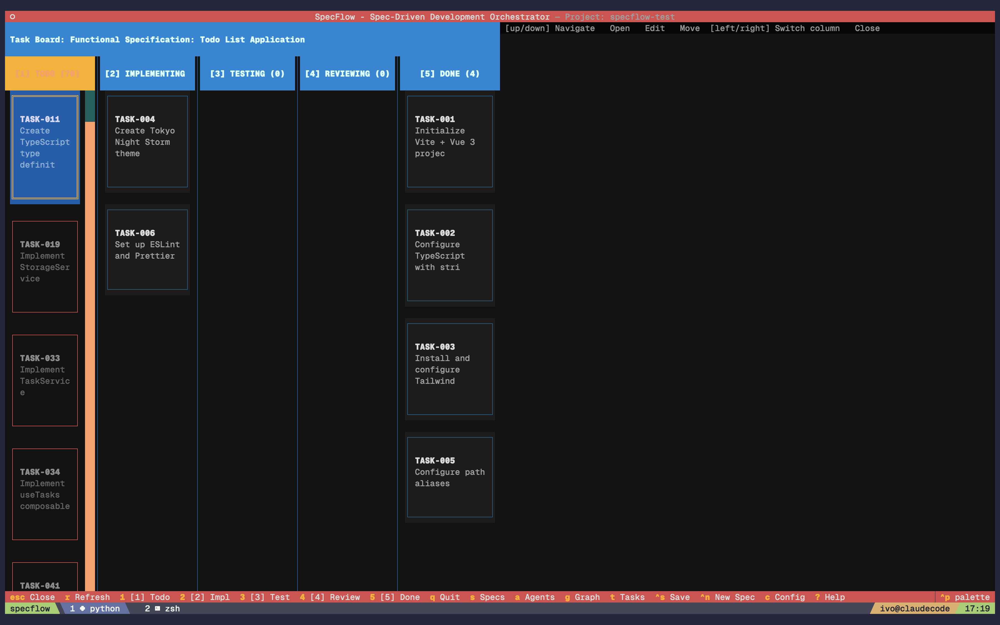
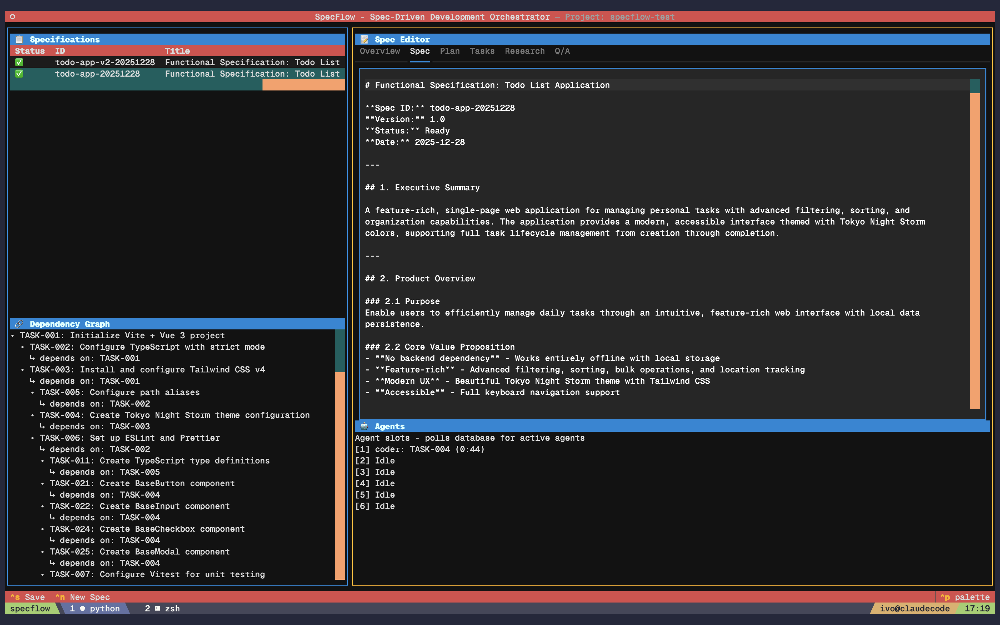
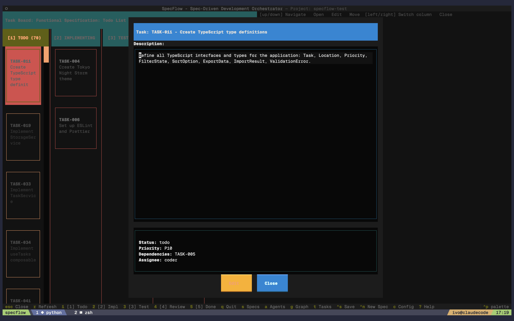

<p align="center">
  
</p>

<p align="center">
  <strong>From requirements to working code — autonomously.</strong>
</p>

<p align="center">
  <a href="#installation">Installation</a> •
  <a href="#quick-start">Quick Start</a> •
  <a href="#features">Features</a> •
  <a href="#cli-reference">CLI Reference</a> •
  <a href="#architecture">Architecture</a>
</p>

---

## What is SpecFlow?

SpecFlow transforms how you build software. Feed it a business requirements document, and watch as AI agents autonomously architect, implement, test, and review your code — all while you monitor progress in a beautiful terminal UI.

**The problem:** Building software from requirements is a manual, error-prone process that requires constant human intervention at every stage.

**The solution:** SpecFlow orchestrates specialized AI agents that work in parallel, each focused on what they do best:

- **Architect** designs the technical approach
- **Coder** implements features in isolated git worktrees
- **Reviewer** ensures code quality and standards
- **Tester** writes and runs comprehensive tests
- **QA** validates everything meets the original requirements

You stay in control through human approval gates during specification, then let the agents execute autonomously while you track real-time progress.

## Screenshots

<p align="center">
  
  <br><em>Dashboard with specs, agents, and dependency graph</em>
</p>

<p align="center">
  
  <br><em>Task swimlane board showing real-time progress</em>
</p>

<p align="center">
  
  <br><em>Specification viewer with markdown rendering</em>
</p>

<p align="center">
  
  <br><em>Task editor with status and dependency management</em>
</p>

## Features

### Document Ingestion & Specification
- **Interactive BRD/PRD Creation** — Guided workflows to capture business and product requirements
- **Document Ingestion** — Import existing requirement documents
- **AI-Assisted Specification** — Generate functional specs with clarification workflow
- **Human Approval Gates** — You control when specs are ready for implementation

### Multi-Agent Orchestration
- **5 Specialized Agents** — Architect, Coder, Reviewer, Tester, QA
- **6 Parallel Execution Slots** — Run multiple agents simultaneously
- **Database-Driven Task Management** — Real-time status tracking
- **Automatic Agent Registration** — TUI shows which agent is working on what

### Git Integration
- **Isolated Worktrees** — Each task runs in its own git worktree
- **Automatic Branching** — `task/{task-id}` branches for every task
- **3-Tier Merge Strategy** — Auto-merge → AI conflict resolution → AI file regeneration
- **Clean Merges** — Automatic cleanup of worktrees and branches

### Developer Experience
- **Interactive TUI** — Beautiful terminal UI for monitoring progress
- **Swimlane Board** — Kanban-style task tracking (Todo → Implementing → Testing → Reviewing → Done)
- **Dependency Graph** — Visualize task dependencies
- **Full CLI** — Every operation available via command line with JSON output
- **CI/CD Ready** — Headless mode for automation pipelines

### Persistence & Memory
- **SQLite Database** — Fast local storage for specs, tasks, and agents
- **Cross-Session Memory** — Entity extraction and context persistence
- **JSONL Sync** — Git-friendly database synchronization

## Installation

### Prerequisites

- Python 3.12+
- Git
- [uv](https://github.com/astral-sh/uv) package manager

### Install via pipx (Recommended)

```bash
pipx install git+https://github.com/ivo-toby/specflow.git
```

### Install from source

```bash
git clone https://github.com/ivo-toby/specflow.git
cd specflow
uv pip install -e ".[dev]"
```

## Quick Start

### 1. Initialize a project

```bash
cd your-project
specflow init
```

This creates:
- `.specflow/` — Configuration and database
- `specs/` — Specification documents
- `.claude/` — Agent definitions, skills, and commands
- `.worktrees/` — Task execution environments (git-ignored)

### 2. Launch the TUI

```bash
specflow tui
```

**Keyboard Shortcuts:**
| Key | Action |
|-----|--------|
| `q` | Quit |
| `s` | Focus specs panel |
| `a` | Focus agents panel |
| `t` | Focus tasks/swimlane |
| `e` | Focus spec editor |
| `g` | Focus dependency graph |
| `r` | Refresh all panels |

### 3. Create requirements (via Claude Code)

```bash
# Interactive BRD creation
/specflow.brd

# Interactive PRD creation
/specflow.prd

# Or ingest existing documents
/specflow.ingest path/to/requirements.md
```

### 4. Generate specification

```bash
/specflow.specify {spec-id}
```

### 5. Create implementation tasks

```bash
/specflow.tasks {spec-id}
```

### 6. Execute autonomous implementation

```bash
/specflow.implement {spec-id}
```

Watch agents work in the TUI as tasks flow through the pipeline!

## CLI Reference

### Project Management

```bash
specflow init [--path PATH] [--update]     # Initialize or update project
specflow status [--json]                    # Show project status
specflow tui [--path PATH]                  # Launch terminal UI
```

### Specification Management

```bash
specflow list-specs [--status STATUS] [--json]
specflow spec-create <id> [--title TITLE] [--source-type brd|prd]
specflow spec-update <id> [--status STATUS] [--title TITLE]
specflow spec-get <id> [--json]
```

### Task Management

```bash
specflow list-tasks [--spec ID] [--status STATUS] [--json]
specflow task-create <id> <spec-id> <title> [--priority 1|2|3] [--dependencies IDS]
specflow task-update <id> <status>
```

**Task statuses:** `todo`, `implementing`, `testing`, `reviewing`, `done`

### Agent Management

```bash
specflow agent-start <task-id> --type coder|tester|reviewer|qa
specflow agent-stop --task <task-id>
specflow list-agents [--json]
```

### Worktree & Merge

```bash
specflow worktree-create <task-id> [--base main]
specflow worktree-commit <task-id> "message"
specflow worktree-list [--json]
specflow worktree-remove <task-id> [--force]
specflow merge-task <task-id> [--target main] [--cleanup]
```

### Headless Execution

```bash
specflow execute [--spec ID] [--task ID] [--max-parallel 6] [--json]
```

## Architecture

### Workflow

```
BRD/PRD → Specification → Tasks → Implementation → Merge
   ↓          ↓            ↓           ↓            ↓
 Human     Human        Auto      Autonomous    Auto/AI
 Input    Approval                 Agents
```

### Task Pipeline

```
TODO → IMPLEMENTING → TESTING → REVIEWING → DONE
         (Coder)      (Tester)  (Reviewer)   (QA)
```

Each task flows through specialized agents with automatic retry and escalation.

### Agent Pool

- **6 concurrent slots** — Parallel task execution
- **Priority queuing** — High-priority tasks execute first
- **Real-time status** — TUI updates as agents work
- **Automatic cleanup** — Stale agents are detected and removed

### Merge Strategy

1. **Tier 1: Git Auto-Merge** — Fast-forward or automatic merge
2. **Tier 2: AI Conflict Resolution** — AI resolves only conflicted sections
3. **Tier 3: AI File Regeneration** — AI regenerates entire conflicted files

### Project Structure

```
project/
├── .specflow/
│   ├── config.yaml          # Configuration
│   ├── database.db          # SQLite database
│   └── memory/              # Cross-session memory
├── specs/
│   └── {spec-id}/
│       ├── brd.md           # Business requirements
│       ├── prd.md           # Product requirements
│       ├── spec.md          # Functional specification
│       └── plan.md          # Implementation plan
├── .claude/
│   ├── agents/              # Agent definitions
│   ├── skills/              # Auto-loading skills
│   └── commands/            # Slash commands
└── .worktrees/              # Task worktrees (git-ignored)
    └── {task-id}/
```

## Configuration

Edit `.specflow/config.yaml`:

```yaml
project_name: my-project

agents:
  max_parallel: 6
  architect:
    model: opus
  coder:
    model: sonnet
  reviewer:
    model: sonnet
  tester:
    model: sonnet
  qa:
    model: sonnet

execution:
  max_iterations: 10
  timeout_minutes: 30
```

## Development

```bash
# Run tests
uv run pytest

# Type checking
uv run mypy src/specflow

# Linting & formatting
uv run ruff check src/specflow
uv run ruff format src/specflow
```

## Troubleshooting

### TUI not updating

```bash
# Reinstall and update templates
pipx install --force /path/to/specflow
specflow init --update
```

### Agent status not showing

Ensure agents call `specflow agent-start` and `specflow agent-stop` commands.

### Worktree issues

```bash
specflow worktree-list              # See all worktrees
specflow worktree-remove <id> --force  # Force remove
git worktree prune                  # Clean up git references
```

## Contributing

1. Fork the repository
2. Create a feature branch
3. Make your changes
4. Run tests (`uv run pytest`)
5. Submit a Pull Request

## License

MIT License — see [LICENSE](LICENSE) for details.

## Acknowledgments

- Built for [Claude Code](https://claude.ai/code)
- Uses [Textual](https://github.com/Textualize/textual) for TUI
- Inspired by spec-driven development practices
